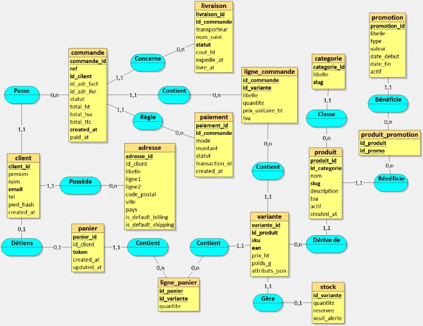
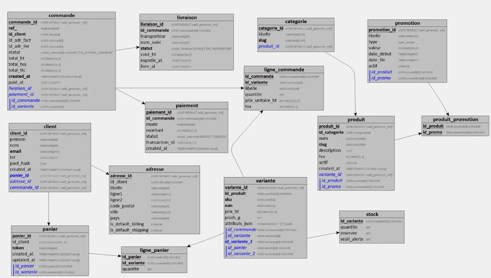

# Projet Final - Bases de Données Relationnelles et Non Relationnelles

## Membres du groupe

Nom/prénom : CLAVERIE Paul
Nom/prénom : SBAI Amine

---

## 1. Présentation du Projet

**ShopEase** est une plateforme e-commerce moderne qui répond à la problématique de gestion d'un catalogue produits complexe avec variantes, tout en collectant et analysant les retours clients et leur comportement. L'objectif est de démontrer l'utilisation combinée et optimale de PostgreSQL pour les données transactionnelles critiques (commandes, paiements, stocks) et de MongoDB pour les données flexibles et évolutives (avis enrichis avec médias, logs d'activité détaillés).

Les fonctionnalités principales incluent :

- **Gestion complète du catalogue** : catégories hiérarchiques, produits avec variantes (couleur, taille, stockage) en JSONB, et gestion temps réel des stocks avec seuils d'alerte
- **Parcours client complet** : inscription/authentification, panier persistant avec token invité, commandes multi-étapes avec traçabilité (brouillon → paiement → expédition → livraison)
- **Fonctionnalités avancées** : système de promotions (pourcentage/montant fixe), avis clients enrichis avec avantages/inconvénients/médias/réactions, logs d'activité détaillés avec structure flexible par type d'événement
- **Dashboard analytique** : statistiques en temps réel sur les ventes, commandes, clients et avis grâce à des agrégations PostgreSQL et MongoDB

## 2. Architecture PostgreSQL (Méthode Merise)

**MCD (Modèle Conceptuel de Données)**  



Le MCD illustre les entités principales (CLIENT, PRODUIT, COMMANDE, PAIEMENT, LIVRAISON, PROMOTION) et leurs relations :

- Un CLIENT peut avoir plusieurs ADRESSES (1,n)
- Un PRODUIT appartient à une CATÉGORIE et possède plusieurs VARIANTES (1,n)
- Une COMMANDE est composée de LIGNES_COMMANDE avec traçabilité (statut ENUM)
- Relations d'association : PANIER ↔ VARIANTE, PRODUIT ↔ PROMOTION

**MLD (Modèle Logique de Données)**  



Le MLD traduit le MCD en schéma relationnel normalisé (3NF) avec :

- Clés primaires UUID pour toutes les tables
- Clés étrangères avec contraintes d'intégrité référentielle (ON DELETE CASCADE/SET NULL)
- Tables d'association pour les relations n:n (ligne_panier, produit_promotion)
- Dénormalisation contrôlée dans ligne_commande (libellé figé, prix_unitaire_ht)

**MPD (Modèle Physique de Données)**

Le schéma complet est implémenté dans `api/postgres/init/01_schema.sql` et `api/postgres/init/02_indexes.sql`.

**Principales tables** :

- `client` (UUID, prenom, nom, email, tel, pwd_hash)
- `adresse` (UUID, id_client, libelle, ligne1/2, code_postal, ville, pays, flags default billing/shipping)
- `categorie` (UUID, libelle, slug, parent_id pour hiérarchie)
- `produit` (UUID, id_categorie, nom, slug, description, tva, actif)
- `variante` (UUID, id_produit, sku, ean, prix_ht, poids_g)
- `stock` (id_variante, quantite, reservee, seuil_alerte)
- `panier` (UUID, id_client, token)
- `ligne_panier` (id_panier, id_variante, quantite)
- `commande` (UUID, ref, id_client, id_adr_fact, id_adr_livr, **statut** ENUM, total_ht/tva/ttc, dates)
- `ligne_commande` (id_commande, id_variante, libelle figé, quantite, prix_unitaire_ht, tva)
- `paiement` (UUID, id_commande, mode, montant, **statut** ENUM, transaction_id)
- `livraison` (UUID, id_commande, transporteur, num_suivi, **statut** ENUM, cout_ht, dates)
- `promotion` (UUID, libelle, **type** ENUM, valeur, date_debut/fin, actif)
- `produit_promotion` (table d'association)

**Spécificités techniques** :

- **UUID** (`uuid-ossp`) pour tous les identifiants
- **JSONB** pour les attributs de variantes (couleur, taille, etc.)
- **ENUMs** pour les statuts (commande, paiement, livraison) et types (promotion)
- **Contraintes** CHECK sur montants, quantités, dates
- **Index composites** pour optimiser les jointures fréquentes

## 3. Architecture MongoDB

MongoDB stocke deux collections avec des structures riches et flexibles (voir `api/mongo/init/99_seed.js`) :

**Collection `avis` (Reviews enrichis)** :

```json
{
  "_id": ObjectId("..."),
  "id_produit": "f1111111-1111-1111-1111-111111111111",
  "produit_info": {
    "nom": "MacBook Pro 14\"",
    "slug": "macbook-pro-14",
    "categorie": {
      "id": "c1111111-1111-1111-1111-111111111112",
      "nom": "Ordinateurs Portables"
    }
  },
  "variante_achetee": {
    "id": "e1111111-1111-1111-1111-111111111111",
    "sku": "MBP14-512-SG",
    "attributs": {
      "couleur": "Gris sidéral",
      "stockage": "512GB",
      "ram": "16GB"
    }
  },
  "auteur": {
    "id_client": "a1111111-1111-1111-1111-111111111111",
    "prenom": "Sophie",
    "nom": "Martin",
    "email_hash": "sophie.m***@example.com",
    "acheteur_verifie": true
  },
  "note": 5,
  "titre": "Excellent produit !",
  "commentaire": "Le MacBook Pro est absolument parfait...",
  "avantages": ["Performance exceptionnelle", "Autonomie impressionnante"],
  "inconvenients": ["Prix élevé"],
  "date_publication": ISODate("2024-05-10T10:00:00Z"),
  "date_achat": ISODate("2024-05-01T10:05:00Z"),
  "verifie": true,
  "reactions": {
    "utile": 24,
    "non_utile": 2,
    "users_liked": ["a2222222-...", "a3333333-..."]
  },
  "reponse_vendeur": null,
  "medias": [
    {
      "type": "image",
      "url": "/reviews/mbp14-review-1.jpg",
      "legende": "Vue d'ensemble du MacBook"
    }
  ],
  "metadata": {
    "ip": "192.168.1.10",
    "user_agent": "Mozilla/5.0 (Macintosh...)",
    "modifie_le": null
  }
}
```

**Collection `logs` (Activity logs avec structure flexible)** :

```json
// Exemple 1 : LOG d'authentification
{
  "_id": ObjectId("..."),
  "type": "AUTH",
  "action": "LOGIN",
  "timestamp": ISODate("2024-06-01T09:00:00Z"),
  "client": {
    "id": "a1111111-1111-1111-1111-111111111111",
    "nom": "Sophie Martin",
    "email": "sophie.martin@example.com"
  },
  "context": {
    "ip": "192.168.1.10",
    "user_agent": "Mozilla/5.0 (Macintosh...)",
    "browser": "Chrome",
    "os": "macOS",
    "device": "Desktop"
  },
  "result": {
    "success": true,
    "method": "password",
    "session_id": "sess_abc123xyz"
  }
}

// Exemple 2 : LOG de commande (structure différente)
{
  "_id": ObjectId("..."),
  "type": "ORDER",
  "action": "CREATE_ORDER",
  "timestamp": ISODate("2024-05-10T09:15:00Z"),
  "client": {
    "id": "a3333333-3333-3333-3333-333333333333",
    "nom": "Marie Bernard"
  },
  "order": {
    "id": "c3333333-3333-3333-3333-333333333333",
    "ref": "CMD-2024-000003",
    "items_count": 1,
    "total_ttc": 719.98,
    "items": [...]
  },
  "addresses": {
    "facturation": {...},
    "livraison": {...}
  },
  "context": {
    "ip": "192.168.1.30",
    "user_agent": "Mozilla/5.0 (iPhone...)"
  }
}

// Exemple 3 : LOG de recherche (encore une structure différente)
{
  "_id": ObjectId("..."),
  "type": "SEARCH",
  "action": "PRODUCT_SEARCH",
  "timestamp": ISODate("2024-06-01T16:35:00Z"),
  "client": {
    "id": "a4444444-4444-4444-4444-444444444444",
    "nom": "Lucas Petit"
  },
  "search": {
    "query": "t-shirt coton bio",
    "filters": {
      "categories": ["mode"],
      "price_range": {"min": 0, "max": 50}
    },
    "results_count": 5,
    "results": [...]
  },
  "analytics": {
    "clicked_position": 1,
    "clicked_product_id": "f8888888-..."
  }
}
```

**Index MongoDB créés** (`api/mongo/init/01_init.js`) :

```javascript
myDb.avis.createIndex({ id_produit: 1 });
myDb.avis.createIndex({ "auteur.id_client": 1 });
myDb.logs.createIndex({ id_client: 1, timestamp: -1 });
```

## 4. Justification des Choix Techniques

### **Répartition des données : PostgreSQL vs MongoDB**

**PostgreSQL (données transactionnelles critiques)** :

- **Clients, Adresses, Produits, Variantes, Stocks** : Nécessitent une intégrité référentielle stricte (clés étrangères) et des contraintes de cohérence (CHECK, UNIQUE). Les relations 1:n et n:n doivent être garanties.
- **Commandes, Paiements, Livraisons** : Données financières critiques nécessitant ACID (transactions atomiques). Une commande doit impérativement être liée à un client existant, des adresses valides et des paiements traçables.
- **Paniers** : Gestion temps réel avec contraintes sur les quantités et liens aux variantes (stock). Les transactions garantissent qu'on ne vend pas plus que le stock disponible.
- **Promotions** : Relations n:n avec produits, contraintes de dates (date_fin > date_debut), ENUMs pour les types.

**MongoDB (données flexibles et évolutives)** :

- **Avis clients** : Structure riche et évolutive (avantages/inconvénients, médias, réactions) qui change selon les besoins métier. Les avis doivent être **dénormalisés** pour éviter des JOINs coûteux lors de l'affichage (produit_info, variante_achetee, auteur sont imbriqués).
- **Logs d'activité** : Chaque type d'événement (AUTH, ORDER, SEARCH, CART, ENGAGEMENT) a une structure différente. MongoDB permet cette **flexibilité de schéma** sans avoir à créer des tables spécifiques pour chaque type de log. Les logs sont en lecture seule et n'ont pas besoin de transactions.

**Pourquoi cette répartition ?**

- PostgreSQL excelle pour les données **structurées, critiques et relationnelles** avec contraintes strictes
- MongoDB excelle pour les données **flexibles, dénormalisées et volumineuses** avec évolution fréquente du schéma
- Séparation claire : **données transactionnelles (PostgreSQL)** vs **données analytiques/UGC (MongoDB)**

### **Modélisation MongoDB : Documents imbriqués**

Nous avons choisi la **dénormalisation avec documents imbriqués** pour :

**Avis clients** :

- ✅ **Performances** : Un seul read pour afficher un avis complet (pas de JOIN avec produits/clients)
- ✅ **Cohérence** : Les infos produit/variante au moment de l'avis sont figées (même si le produit change après)
- ✅ **Flexibilité** : Facile d'ajouter de nouveaux champs (videos, réponse_vendeur, tags)
- ⚠️ **Inconvénient** : Duplication des données produit, mais acceptable car les avis sont en lecture majoritaire

**Logs d'activité** :

- ✅ **Flexibilité** : Chaque type de log peut avoir sa propre structure sans impacter les autres
- ✅ **Performances** : Index composite `{id_client: 1, timestamp: -1}` permet une récupération ultra-rapide de l'historique client
- ✅ **Volumétrie** : MongoDB gère facilement des millions de logs sans dégradation

### **Relations inter-bases : Comment l'API relie PostgreSQL et MongoDB**

L'API FastAPI (`api/fastApi/app/main.py`) fait le pont entre les deux bases :

**1. Liens par identifiants UUID/STRING** :

- Les avis stockent `id_produit` (UUID PostgreSQL) et `auteur.id_client` (UUID PostgreSQL)
- Les logs stockent `client.id`, `order.id`, `produit_id` pour permettre des jointures logiques côté API

**2. Exemple concret** (`api/fastApi/app/routers/stats.py`) :

```python
@router.get("/global")
async def get_global_stats(pool=Depends(get_pg), db=Depends(get_mongo)):
    # Stats PostgreSQL (transactionnel)
    async with pool.acquire() as conn:
        total_ventes = await conn.fetchval("SELECT SUM(total_ttc) FROM commande WHERE statut IN ('PAYEE'...)")
        nb_clients = await conn.fetchval("SELECT COUNT(*) FROM client")
    
    # Stats MongoDB (analytique)
    nb_avis = await db["avis"].count_documents({})
    nb_logs = await db["logs"].count_documents({})
    
    return {"total_ventes": total_ventes, "nb_clients": nb_clients, "nb_avis": nb_avis}
```

**3. Flux de données** :

- Création de commande → PostgreSQL (transaction ACID) + Log MongoDB (`type: "ORDER"`)
- Ajout d'avis → MongoDB (document enrichi) avec `id_produit` référençant PostgreSQL
- Dashboard analytique → Agrégation des deux bases côté API

**4. Cohérence éventuelle** :

- Pas de contraintes d'intégrité référentielle inter-bases (MongoDB ne connaît pas PostgreSQL)
- L'API garantit la cohérence : avant d'insérer un avis, elle vérifie que le produit existe en PostgreSQL
- Si un produit est supprimé en PostgreSQL, les avis MongoDB restent (historique conservé avec `produit_info` figé)

## 5. Exemples de Requêtes Complexes

### **PostgreSQL**

**Exemple 1 : Statistiques avancées sur les commandes avec filtres conditionnels**

```sql
-- Source: api/fastApi/app/routers/commandes.py (ligne 28-39)
-- Utilise COUNT FILTER, agrégations conditionnelles et sous-requêtes
SELECT 
    COUNT(*) as total_commandes,
    COUNT(*) FILTER (WHERE statut IN ('PAYEE', 'PREPAREE', 'EXPEDIEE', 'LIVREE')) as nb_validees,
    COUNT(*) FILTER (WHERE statut IN ('BROUILLON', 'EN_ATTENTE_PAIEMENT')) as nb_en_attente,
    COUNT(*) FILTER (WHERE statut = 'ANNULEE') as nb_annulees,
    COALESCE(SUM(total_ttc), 0) as montant_total,
    COALESCE(AVG(total_ttc), 0) as montant_moyen
FROM commande;
```

**Exemple 2 : Répartition des commandes par statut avec pourcentage**

```sql
-- Source: api/fastApi/app/routers/commandes.py (ligne 42-52)
-- Calcul de pourcentages avec division et sous-requête
SELECT 
    statut,
    COUNT(*) as count,
    ROUND(
        COUNT(*) * 100.0 / NULLIF((SELECT COUNT(*) FROM commande), 0), 
        2
    ) as pourcentage
FROM commande
GROUP BY statut
ORDER BY count DESC;
```

**Exemple 3 : Analyse temporelle avec agrégation par jour**

```sql
-- Source: api/fastApi/app/routers/commandes.py (ligne 55-66)
-- Agrégation par date avec filtre temporel (30 derniers jours)
SELECT 
    DATE(created_at) as date,
    COUNT(*) as nombre_commandes,
    COALESCE(SUM(total_ttc), 0) as total_ventes
FROM commande
WHERE created_at >= NOW() - INTERVAL '30 days'
GROUP BY DATE(created_at)
ORDER BY date DESC;
```

**Exemple 4 : Jointures multiples avec sous-requêtes corrélées**

```sql
-- Source: api/fastApi/app/routers/commandes.py (ligne 11-19)
-- JOIN avec client + sous-requête corrélée pour compter les lignes
SELECT co.*,
       (cl.prenom || ' ' || cl.nom) AS client_nom,
       (SELECT COUNT(*) 
        FROM ligne_commande lc 
        WHERE lc.id_commande = co.id) AS nb_lignes
FROM commande co
JOIN client cl ON cl.id = co.id_client
ORDER BY co.created_at DESC;
```

**Exemple 5 : Transaction atomique avec décrément de stock**

```sql
-- Source: api/fastApi/app/routers/commandes.py (ligne 112-133)
-- Transaction ACID garantissant cohérence stock/commande
BEGIN;
  -- Insertion commande
  INSERT INTO commande (ref, id_client, id_adr_fact, id_adr_livr, total_ht, total_tva, total_ttc)
  VALUES ($1,$2,$3,$4,$5,$6,$7)
  RETURNING *;
  
  -- Pour chaque ligne
  INSERT INTO ligne_commande (id_commande, id_variante, libelle, quantite, prix_unitaire_ht, tva)
  VALUES ($1,$2,$3,$4,$5,$6);
  
  -- Décrément atomique du stock avec vérification
  UPDATE stock 
  SET quantite = quantite - $1 
  WHERE id_variante=$2 AND quantite >= $1;
COMMIT;
```

**Exemple 6 : Index partiel pour optimisation ciblée**

```sql
-- Source: api/postgres/init/02_indexes.sql (ligne 25-26)
-- Index uniquement sur les commandes en attente (économie d'espace)
CREATE INDEX IF NOT EXISTS idx_commande_non_payee 
ON commande(statut, created_at) 
WHERE statut = 'EN_ATTENTE_PAIEMENT';

-- Index pour les livraisons en cours uniquement
CREATE INDEX IF NOT EXISTS idx_livraison_en_cours 
ON livraison(statut, expedie_at) 
WHERE statut IN ('EXPEDIEE', 'EN_TRANSIT');
```

### **MongoDB**

**Exemple 1 : Pipeline d'agrégation complexe avec $facet (statistiques multi-dimensions)**

```javascript
// Source: api/fastApi/app/routers/avis.py (ligne 22-51)
// Calcul de 4 métriques en parallèle dans une seule requête
db.avis.aggregate([
  {
    $facet: {
      // Métrique 1 : Note moyenne globale
      "moyenne": [
        {
          $group: {
            _id: null,
            note_moyenne: { $avg: "$note" }
          }
        }
      ],
      
      // Métrique 2 : Avis ce mois-ci (filtre temporel)
      "ce_mois": [
        {
          $match: {
            "date": {
              $gte: new Date("2024-06-01T00:00:00Z")
            }
          }
        },
        { $count: "total" }
      ],
      
      // Métrique 3 : Répartition des notes (1 à 5 étoiles)
      "repartition": [
        {
          $group: {
            _id: "$note",
            count: { $sum: 1 }
          }
        },
        { $sort: { _id: -1 } }
      ],
      
      // Métrique 4 : Total des avis
      "total": [
        { $count: "count" }
      ]
    }
  }
]);
```

**Exemple 2 : Requête avec index composé et tri**

```javascript
// Source: api/fastApi/app/routers/avis.py (ligne 11 et 89-91)
// Utilise l'index { id_produit: 1 } + tri descendant sur date
db.avis.find({ 
  id_produit: "f1111111-1111-1111-1111-111111111111" 
}).sort({ date: -1 });
```

**Exemple 3 : Requête sur champs imbriqués (dot notation)**

```javascript
// Index créé: { "auteur.id_client": 1 }
// Recherche d'avis par client avec projection
db.avis.find(
  { "auteur.id_client": "a1111111-1111-1111-1111-111111111111" },
  { 
    titre: 1, 
    note: 1, 
    "produit_info.nom": 1,
    date_publication: 1,
    _id: 0
  }
).sort({ date_publication: -1 });
```

**Exemple 4 : Requête complexe sur logs avec filtres multiples**

```javascript
// Récupération de l'historique d'activité d'un client
// Utilise l'index composé { id_client: 1, timestamp: -1 }
db.logs.find({
  "client.id": "a1111111-1111-1111-1111-111111111111",
  "timestamp": { 
    $gte: ISODate("2024-06-01T00:00:00Z"),
    $lte: ISODate("2024-06-30T23:59:59Z")
  },
  "type": { $in: ["ORDER", "CART", "PAYMENT"] }
}).sort({ timestamp: -1 }).limit(50);
```

**Exemple 5 : Agrégation pour analytics (recherches populaires)**

```javascript
// Analyse des recherches les plus fréquentes
db.logs.aggregate([
  {
    $match: {
      type: "SEARCH",
      action: "PRODUCT_SEARCH"
    }
  },
  {
    $group: {
      _id: "$search.query",
      count: { $sum: 1 },
      avg_results: { $avg: "$search.results_count" },
      click_through_rate: {
        $avg: {
          $cond: [
            { $ifNull: ["$analytics.clicked_product_id", false] },
            1,
            0
          ]
        }
      }
    }
  },
  {
    $match: {
      count: { $gte: 5 }  // Seulement les recherches fréquentes
    }
  },
  {
    $sort: { count: -1 }
  },
  {
    $limit: 20
  }
]);
```

**Exemple 6 : Update avec opérateurs atomiques (réactions)**

```javascript
// Ajout d'une réaction "utile" à un avis
db.avis.updateOne(
  { _id: ObjectId("...") },
  {
    $inc: { "reactions.utile": 1 },
    $addToSet: { 
      "reactions.users_liked": "a2222222-2222-2222-2222-222222222222" 
    }
  }
);
```

## 6. Stratégie de Sauvegarde

### **PostgreSQL : Stratégie hybride (complète + continue)**

#### **Solutions de sauvegarde PostgreSQL**

**1. `pg_dump` / `pg_dumpall` (Sauvegarde logique)**

- ✅ **Avantages** : Format texte (SQL), portable entre versions PostgreSQL, restauration sélective possible
- ⚠️ **Inconvénients** : Plus lent pour grandes bases, nécessite de rejouer les commandes SQL
- **Usage recommandé** : Sauvegardes complètes quotidiennes/hebdomadaires

**2. `pg_basebackup` (Sauvegarde physique)**

- ✅ **Avantages** : Très rapide (copie binaire), restauration immédiate
- ⚠️ **Inconvénients** : Non portable entre versions, nécessite l'archivage WAL pour cohérence
- **Usage recommandé** : Sauvegardes complètes avant mise à jour majeure

**3. WAL archiving (Write-Ahead Logging - Sauvegarde continue)**

- ✅ **Avantages** : Point-in-time recovery (PITR), perte de données minimale (secondes), continuité
- ⚠️ **Inconvénients** : Configuration complexe, espace de stockage important
- **Usage recommandé** : Production critique nécessitant RPO < 1 minute

**4. Replica / Streaming Replication**

- ✅ **Avantages** : Haute disponibilité, basculement automatique, zéro perte de données
- ⚠️ **Inconvénients** : Coûteux (serveur secondaire), complexité opérationnelle
- **Usage recommandé** : Production critique nécessitant RTO < 5 minutes

#### **Notre stratégie recommandée pour PostgreSQL**

**Approche hybride combinant :**

```bash
# 1. SAUVEGARDE COMPLÈTE QUOTIDIENNE (pg_dump)
# Tous les jours à 2h du matin
0 2 * * * docker exec shopease_postgres pg_dump -U admin -d shopease \
  --format=custom \
  --file=/backups/shopease_$(date +\%Y\%m\%d).dump \
  --verbose

# Format custom (-Fc) : compressé + restauration sélective
# Rétention : 7 jours (quotidien) + 4 semaines (hebdomadaire) + 12 mois (mensuel)
```

```bash
# 2. SAUVEGARDE INCRÉMENTALE (WAL archiving)
# Configuration PostgreSQL (postgresql.conf)
wal_level = replica
archive_mode = on
archive_command = 'cp %p /backups/wal_archive/%f'
archive_timeout = 300  # Force archivage toutes les 5 min minimum

# Permet de restaurer à n'importe quel point entre deux sauvegardes complètes
```

```bash
# 3. EXPORT LOGIQUE HEBDOMADAIRE (pg_dumpall)
# Tous les dimanches à 3h (inclut rôles et configs globales)
0 3 * * 0 docker exec shopease_postgres pg_dumpall -U admin \
  --file=/backups/shopease_all_$(date +\%Y\%m\%d).sql \
  --verbose
```

**Fréquence** :

- **Complète (pg_dump custom)** : Quotidienne (2h du matin), rétention 7 jours
- **Hebdomadaire (pg_dumpall)** : Dimanche 3h, rétention 4 semaines
- **Mensuelle** : 1er du mois, rétention 12 mois
- **Continue (WAL)** : Temps réel, rétention 7 jours

**Localisation** :

- **Locale** : Volume Docker `./backups/postgres/` (pour tests rapides)
- **Distante** : Synchronisation vers S3/Azure Blob Storage (production)
- **Réplication** : Serveur standby en streaming replication (production critique)

#### **Procédure de restauration PostgreSQL**

**Cas 1 : Restauration complète depuis pg_dump**

```bash
# 1. Arrêter l'application
docker-compose stop api frontend

# 2. Supprimer la base existante
docker exec shopease_postgres psql -U admin -c "DROP DATABASE IF EXISTS shopease;"
docker exec shopease_postgres psql -U admin -c "CREATE DATABASE shopease;"

# 3. Restaurer depuis le dump
docker exec shopease_postgres pg_restore -U admin -d shopease \
  --verbose \
  /backups/shopease_20241029.dump

# 4. Redémarrer l'application
docker-compose start api frontend

# Temps estimé : 2-5 minutes pour 10GB, RTO ≈ 5 min
```

**Cas 2 : Point-in-Time Recovery (PITR) avec WAL**

```bash
# Restaurer à 14h30 le 29/10/2024
# 1. Restaurer la dernière sauvegarde complète avant 14h30
pg_restore -d shopease /backups/shopease_20241029.dump

# 2. Appliquer les WAL jusqu'à 14h30
# Dans recovery.conf :
restore_command = 'cp /backups/wal_archive/%f %p'
recovery_target_time = '2024-10-29 14:30:00'

# PostgreSQL rejouera automatiquement les transactions WAL
# Temps estimé : 10-30 minutes selon volume WAL, RTO ≈ 30 min
```

---

### **MongoDB : Stratégie native + replica set**

#### **Solutions de sauvegarde MongoDB**

**1. `mongodump` / `mongorestore` (Sauvegarde logique)**

- ✅ **Avantages** : Format BSON portable, restauration sélective (collection), simple
- ⚠️ **Inconvénients** : Lent pour grandes collections, impact performance pendant le dump
- **Usage recommandé** : Sauvegardes complètes quotidiennes/hebdomadaires

**2. Filesystem snapshots (LVM, EBS, ZFS)**

- ✅ **Avantages** : Très rapide, cohérence atomique, restauration instantanée
- ⚠️ **Inconvénients** : Nécessite arrêt MongoDB ou fsync+lock, dépendant du système de fichiers
- **Usage recommandé** : Sauvegardes complètes avant maintenance majeure

**3. Replica Set avec Oplog**

- ✅ **Avantages** : Haute disponibilité (0 RTO), cohérence automatique, backup "vivant"
- ⚠️ **Inconvénients** : Coût (3 nœuds minimum), complexité, pas de protection contre corruption logique
- **Usage recommandé** : Production critique (recommandé par MongoDB Inc.)

**4. MongoDB Atlas Backup (Cloud)**

- ✅ **Avantages** : Automatique, PITR, gestion zéro, restauration en quelques clics
- ⚠️ **Inconvénients** : Coût élevé, dépendance au cloud
- **Usage recommandé** : Production sans équipe DevOps dédiée

**5. `mongodump --oplog` (Dump + oplog)**

- ✅ **Avantages** : Cohérence point-in-time, combinaison dump + transactions récentes
- ⚠️ **Inconvénients** : Oplog limité en taille, nécessite replica set
- **Usage recommandé** : Sauvegardes complètes avec cohérence transactionnelle

#### **Notre stratégie recommandée pour MongoDB**

**Approche : Replica Set (3 nœuds) + mongodump quotidien**

```bash
# CONFIGURATION REPLICA SET (docker-compose.yml - production)
services:
  mongo-primary:
    image: mongo:7
    command: --replSet rs0 --bind_ip_all
    ports: ["27017:27017"]
    
  mongo-secondary1:
    image: mongo:7
    command: --replSet rs0 --bind_ip_all
    ports: ["27018:27017"]
    
  mongo-secondary2:
    image: mongo:7
    command: --replSet rs0 --bind_ip_all
    ports: ["27019:27017"]

# Initialisation du replica set
rs.initiate({
  _id: "rs0",
  members: [
    { _id: 0, host: "mongo-primary:27017", priority: 2 },
    { _id: 1, host: "mongo-secondary1:27017", priority: 1 },
    { _id: 2, host: "mongo-secondary2:27017", priority: 1 }
  ]
})
```

```bash
# 1. SAUVEGARDE COMPLÈTE QUOTIDIENNE (mongodump avec oplog)
# Tous les jours à 3h du matin sur le secondaire (pas d'impact sur prod)
0 3 * * * docker exec shopease_mongo_secondary1 mongodump \
  --uri="mongodb://mongo-secondary1:27017/shopease" \
  --oplog \
  --gzip \
  --out=/backups/mongo_$(date +\%Y\%m\%d)

# --oplog : capture les opérations pendant le dump (cohérence)
# --gzip : compression pour économiser l'espace
# Rétention : 7 jours (quotidien) + 4 semaines (hebdomadaire)
```

```bash
# 2. EXPORT JSON HEBDOMADAIRE (pour audit/analyse)
# Tous les dimanches à 4h
0 4 * * 0 docker exec shopease_mongo mongoexport \
  --uri="mongodb://mongo:27017/shopease" \
  --collection=avis \
  --out=/backups/avis_$(date +\%Y\%m\%d).json

0 4 * * 0 docker exec shopease_mongo mongoexport \
  --uri="mongodb://mongo:27017/shopease" \
  --collection=logs \
  --out=/backups/logs_$(date +\%Y\%m\%d).json
```

**Fréquence** :

- **Complète (mongodump)** : Quotidienne (3h du matin), rétention 7 jours
- **Hebdomadaire (JSON export)** : Dimanche 4h, rétention 4 semaines
- **Mensuelle** : 1er du mois, rétention 12 mois
- **Continue (Replica Set)** : Temps réel via oplog, failover automatique

**Localisation** :

- **Locale** : Volume Docker `./backups/mongo/`
- **Distante** : Synchronisation vers S3/Azure (via rclone ou script)
- **Réplication** : 2 secondaires (1 dans même datacenter, 1 distant pour DR)

#### **Procédure de restauration MongoDB**

**Cas 1 : Restauration complète depuis mongodump**

```bash
# 1. Arrêter l'application
docker-compose stop api frontend

# 2. Vider les collections existantes
docker exec shopease_mongo mongosh shopease --eval "
  db.avis.drop();
  db.logs.drop();
"

# 3. Restaurer depuis le dump
docker exec shopease_mongo mongorestore \
  --uri="mongodb://mongo:27017/shopease" \
  --gzip \
  --oplogReplay \
  /backups/mongo_20241029

# --oplogReplay : applique les opérations capturées pendant le dump

# 4. Redémarrer l'application
docker-compose start api frontend

# Temps estimé : 1-3 minutes pour 5GB, RTO ≈ 5 min
```

**Cas 2 : Failover automatique (Replica Set)**

```bash
# Si le primaire tombe, le replica set élit automatiquement un nouveau primaire
# L'application reconnecte automatiquement (connection string avec tous les membres)
mongodb://mongo-primary:27017,mongo-secondary1:27017,mongo-secondary2:27017/shopease?replicaSet=rs0

# Temps de basculement : 10-30 secondes (élection), RTO ≈ 30s, RPO = 0
```

**Cas 3 : Restauration d'une collection spécifique**

```bash
# Restaurer uniquement la collection 'avis'
docker exec shopease_mongo mongorestore \
  --uri="mongodb://mongo:27017/shopease" \
  --collection=avis \
  --gzip \
  /backups/mongo_20241029/shopease/avis.bson.gz

# Temps estimé : <1 minute, RTO ≈ 2 min
```

---

### **Résumé comparatif des stratégies**

| Critère | PostgreSQL | MongoDB |
|---------|-----------|----------|
| **Méthode principale** | pg_dump (custom) + WAL | mongodump + Replica Set |
| **Fréquence complète** | Quotidienne (2h) | Quotidienne (3h) |
| **Sauvegarde continue** | WAL archiving (5 min) | Replica Set (temps réel) |
| **RPO** (perte max données) | 5 minutes (WAL) | 0 secondes (replica set) |
| **RTO** (temps restauration) | 5-30 minutes | 30 secondes (failover) / 5 min (restore) |
| **Espace requis** | ~2x taille DB (dump+WAL) | ~3x taille DB (replica) |
| **Complexité** | Moyenne (WAL config) | Élevée (replica set 3 nœuds) |
| **Coût** | 1 serveur + stockage | 3 serveurs (production) |

### **Automatisation avec scripts**

```bash
# Script backup_all.sh
#!/bin/bash
DATE=$(date +%Y%m%d_%H%M%S)

# PostgreSQL
docker exec shopease_postgres pg_dump -U admin -Fc shopease > /backups/pg_$DATE.dump

# MongoDB
docker exec shopease_mongo mongodump --uri="mongodb://mongo:27017/shopease" --gzip --out=/backups/mongo_$DATE

# Nettoyage (garder 7 derniers jours)
find /backups -name "pg_*" -mtime +7 -delete
find /backups -name "mongo_*" -mtime +7 -delete

# Upload vers S3 (optionnel)
aws s3 sync /backups s3://shopease-backups/$(date +%Y/%m)/

echo "✅ Backup completed: $DATE"
```

```bash
# Ajout au cron
0 2 * * * /opt/scripts/backup_all.sh >> /var/log/backup.log 2>&1
```

## 7. Lancement & Tests

### **Démarrage de l'application**

```bash
# 1. Configuration de l'environnement (si pas déjà fait)
cp ./api/fastApi/.env.example ./api/fastApi/.env

# 2. Démarrage des conteneurs Docker
docker-compose up --build -d

# 3. Vérification de la santé de l'API
curl http://localhost:8000/api/health
# Résultat attendu : {"status":"ok","postgres":true,"mongo":true}

# 4. Accès au frontend
# Ouvrir http://localhost:3000 dans le navigateur
```

### **Services disponibles**

| Service | URL | Description |
|---------|-----|-------------|
| **Frontend** | <http://localhost:3000> | Interface utilisateur Next.js |
| **API REST** | <http://localhost:8000> | API FastAPI |
| **Documentation API** | <http://localhost:8000/docs> | Swagger UI interactif |
| **pgAdmin** | <http://localhost:8081> | Interface PostgreSQL (<admin@example.com> / admin) |
| **mongo-express** | <http://localhost:8082> | Interface MongoDB |

### **Endpoints clés de l'API**

**PostgreSQL (données transactionnelles)** :

- **Catégories** : `GET/POST/PUT/DELETE /api/categories`
- **Clients** : `GET/POST/PUT/DELETE /api/clients`
- **Adresses** : `GET/POST/PUT/DELETE /api/adresses`
- **Produits** : `GET/POST/PUT/DELETE /api/produits`
  - Variantes : `GET/POST /api/produits/{id}/variantes`
  - Stock : `PATCH /api/produits/variantes/{id}/stock`
- **Paniers** : `GET/POST /api/paniers`
- **Commandes** : `GET/POST/PUT/DELETE /api/commandes`
  - Stats : `GET /api/commandes/stats`
- **Paiements** : `GET/POST/PUT /api/paiements`
- **Livraisons** : `GET/POST/PUT/DELETE /api/livraisons`
- **Promotions** : `GET/POST/PUT/DELETE /api/promotions`

**MongoDB (données flexibles)** :

- **Avis** : `GET/POST /api/avis`
  - Par produit : `GET /api/avis/{id_produit}`
  - Stats : `GET /api/avis/stats`
- **Logs** : `GET/POST /api/logs`
  - Par client : `GET /api/logs/{id_client}`

**Statistiques globales (hybride)** :

- `GET /api/stats/global` - Agrégation PostgreSQL + MongoDB
- `GET /api/stats/dashboard` - KPIs temps réel

### **Scripts d'initialisation et données de test**

**PostgreSQL** :

- `api/postgres/init/01_schema.sql` - Création des tables, ENUMs, contraintes
- `api/postgres/init/02_indexes.sql` - Index optimisés (GIN, composites, partiels)
- `api/postgres/init/99_seed.sql` - **Données de test déjà présentes** (clients, produits, commandes)

**MongoDB** :

- `api/mongo/init/01_init.js` - Création des collections et index
- `api/mongo/init/99_seed.js` - **Données de test déjà présentes** (6 avis enrichis, 15 logs variés)

> ✅ **Les bases de données sont automatiquement peuplées au premier démarrage** grâce aux scripts dans `/docker-entrypoint-initdb.d/`

### **Tests rapides**

```bash
# Test 1 : Liste des produits avec catégories (PostgreSQL)
curl http://localhost:8000/api/produits

# Test 2 : Recherche de produits (PostgreSQL)
curl "http://localhost:8000/api/produits?q=macbook"

# Test 3 : Avis d'un produit (MongoDB)
curl http://localhost:8000/api/avis

# Test 4 : Statistiques des commandes (PostgreSQL - agrégation)
curl http://localhost:8000/api/commandes/stats

# Test 5 : Statistiques globales (Hybride PostgreSQL + MongoDB)
curl http://localhost:8000/api/stats/global

# Test 6 : Logs d'activité (MongoDB)
curl http://localhost:8000/api/logs
```

### **Vérification des données**

```bash
# PostgreSQL : Compter les enregistrements
docker exec shopease_postgres psql -U admin -d shopease -c "
  SELECT 
    'clients' as table_name, COUNT(*) as count FROM client
  UNION ALL
  SELECT 'produits', COUNT(*) FROM produit
  UNION ALL
  SELECT 'commandes', COUNT(*) FROM commande
  UNION ALL
  SELECT 'variantes', COUNT(*) FROM variante;
"

# MongoDB : Compter les documents
docker exec shopease_mongo mongosh shopease --quiet --eval "
  print('Avis: ' + db.avis.countDocuments());
  print('Logs: ' + db.logs.countDocuments());
  print('Types de logs: ' + JSON.stringify(db.logs.distinct('type')));
"
```

### **Documentation complète**

Pour plus de détails, consultez :

- **[TESTS_CRUD.md](TESTS_CRUD.md)** - Exemples de tests pour tous les endpoints
- **[ENDPOINTS.md](ENDPOINTS.md)** - Documentation exhaustive de l'API
